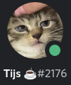

_"From this day, every other day is otter day"_
~ Tijs (June 30th 2020)

For that we shall never forget the reason of otter-bots existance.

# Commands

- **?help**: Gives a list of commands.
- **?otterday**: Is it otterday?
- **?otter**: Gives an otterpic.
- **?weirdotter**: GIves a weird looking otterpic.
- **?howmanyotterdays**: How many otterdays have passed?
- **?whodis**: Gives some info about the coders!

# Backlog

Find the things that have been on our minds here.

https://trello.com/b/BLeuD8bv/otter-bot

# Resources

We use a couple of cool libraries to develop otter-bot:

### Built with

- [Nodejs](https://nodejs.org/en) ^14.6.0,
- [Ts-node](https://github.com/TypeStrong/ts-node) ^8.10.2,
- [Typescript](https://www.npmjs.com/package/typescript) ^3.9.7,
- [Discord.js](https://discord.js.org/) ^12.2.0,

### Tested by

- [Jest](https://nodejs.org/en/) ^26.2.2,
- [Ts-jest](https://github.com/kulshekhar/ts-jest) ^26.1.4,

### Utilizes

- [Axios](https://www.npmjs.com/package/axios) ^0.19.2,
- [Dotenv](https://www.npmjs.com/package/dotenv) ^8.2.0,
- [Moment-timezone](https://momentjs.com/timezone) ^0.5.31,
- [Winston](https://www.npmjs.com/package/winston) ^3.3.3,

# Contributors

|            |                 |
| ------------------------------------ | ----------------------------------------- |
| Tijs de Graaff                       | Auke Steenman                             |
| _shinyra_                            | _postellaar_                              |
| [GitHub](https://github.com/ShinyRa) | [GitHub](https://github.com/AukeSteenman) |

# Discord

Have suggestions? Do you want to get involved in the development of otter-bot? You can find us and the bot here!

[discord server](https://discord.gg/98egQW)

